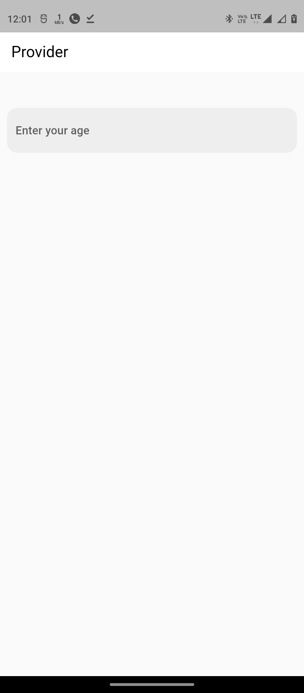
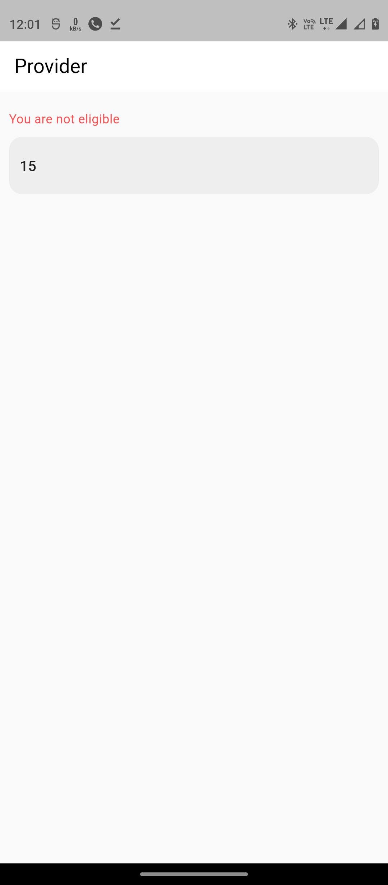
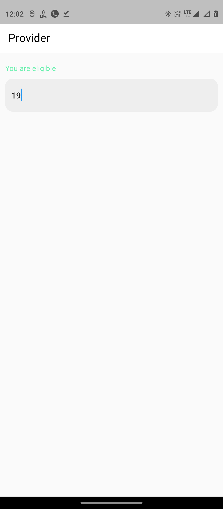

# Sample App Using Provider
### State Management using Provider
### **Live Demo** : [https://ashutosh-rai-78.github.io/sample_app_using_provider](https://ashutosh-rai-78.github.io/sample_app_using_provider)

## Screensshots
---

<!-- 

 -->

